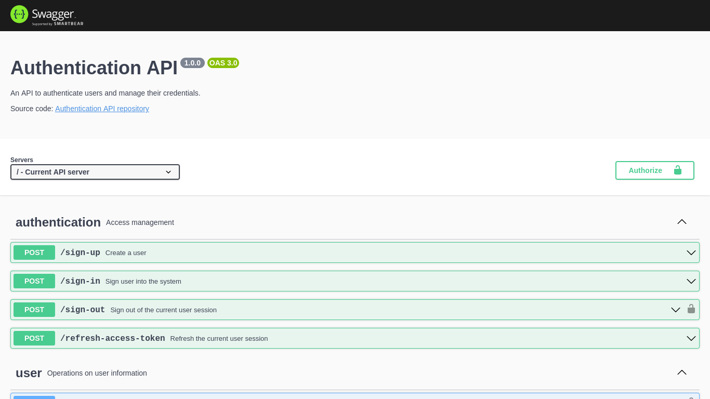

[](https://sonarcloud.io/summary/new_code?id=nataelienai_authentication-api)

# Authentication API

Authentication API é uma Web API para autenticar usuários e gerenciar suas
credenciais. Através dela, é possível se cadastrar, criar, atualizar e encerrar
sessões e consultar, editar e excluir sua conta.

Este projeto é o resultado de meses de estudo dos princípios SOLID e de padrões arquiteturais como Hexagonal Architecture (Ports & Adapters), Onion Architecture e Clean Architecture. Além de aplicá-los, a API foi construída para aprender novas tecnologias e compreender e usar conceitos, ferramentas e práticas que ajudam a melhorar a qualidade do código.

Para mais detalhes sobre o funcionamento da API, acesse a [documentação online](https://an-authentication-api.onrender.com/api-docs).

<p align="center">
  <a href="https://an-authentication-api.onrender.com/api-docs" target="_blank"></a>
</p>

## Tecnologias usadas

- **Linguagem:** JavaScript & TypeScript.
- **Ferramentas:** Node.js, npm (Node Package Manager), SonarCloud, Docker, Git,
  GitHub & GitHub Actions.
- **Frameworks e bibliotecas:** Express.js, JSON Web Token (JWT), Prisma, Bcrypt, Zod, Jest, Babel, Swagger UI Express (OpenAPI 3 & Swagger), ESLint (Airbnb Style Guide) & Prettier.
- **Banco de dados:** PostgreSQL & Redis.

## Estrutura de pastas

```
.
├── src/
│   ├── application/ -> camada de aplicação (regras de negócio de funcionalidades)
│   │   ├── errors/
│   │   ├── ports/
│   │   └── use-cases/
│   ├── docs/  -> arquivos relacionados à documentação
│   ├── domain/  -> camada de domínio (regras de negócio de entidades)
│   │   └── errors/
│   ├── infra/  -> camada de infraestrutura (implementação e validação de I/O)
│   │   ├── database/
│   │   ├── http/
│   │   ├── logging/
│   │   └── services/
│   ├── main/  -> camada principal (instanciação de objetos e inicialização da aplicação)
│   │   └── instances/
│   ├── presentation/  -> camada de apresentação (formato dos dados)
│   │   ├── controllers/
│   │   ├── errors/
│   │   ├── ports/
│   │   └── utils/
│   └── shared/  -> recursos compartilhados entre camadas
└── test/  -> recursos usados em testes (mocks, stubs, fakes...)
```

## Como executar a API localmente

### Dependências

Você precisará instalar as ferramentas [Git](https://git-scm.com/downloads) e [Docker](https://docs.docker.com/get-docker/) em sua máquina para conseguir clonar o repositório e executar a aplicação.

### Clonando o repositório em sua máquina

1. Dentro de um terminal, clone o repositório:

```sh
git clone https://github.com/nataelienai/authentication-api.git
```

2. Entre na pasta do repositório clonado:

```sh
cd authentication-api
```

### Executando a API

1. Dentro da pasta do repositório clonado, inicie a API com o Docker Compose:

```sh
docker compose up
```

- Aguarde até que o servidor da API inicie, aparecendo a seguinte mensagem:

```
api    | 2023-07-13T17:45:38.259Z info: HTTP server listening on port 3000
```

- A URL base da API é `http://localhost:3000` e sua documentação estará disponível em `http://localhost:3000/api-docs`. Para encerrar a execução, pressione as teclas `Ctrl + C` no terminal.

### Executando os testes

1. Dentro da pasta do repositório clonado, crie uma imagem Docker da API:

```sh
docker build --tag authentication-api .
```

2. Execute os testes usando a imagem gerada:

```sh
docker run -it --rm --name authentication-api-test authentication-api npm test
```

- Para coletar a cobertura de código nos testes, substitua o comando anterior por:

```sh
docker run -it --rm --name authentication-api-test authentication-api npm run test:coverage
```
